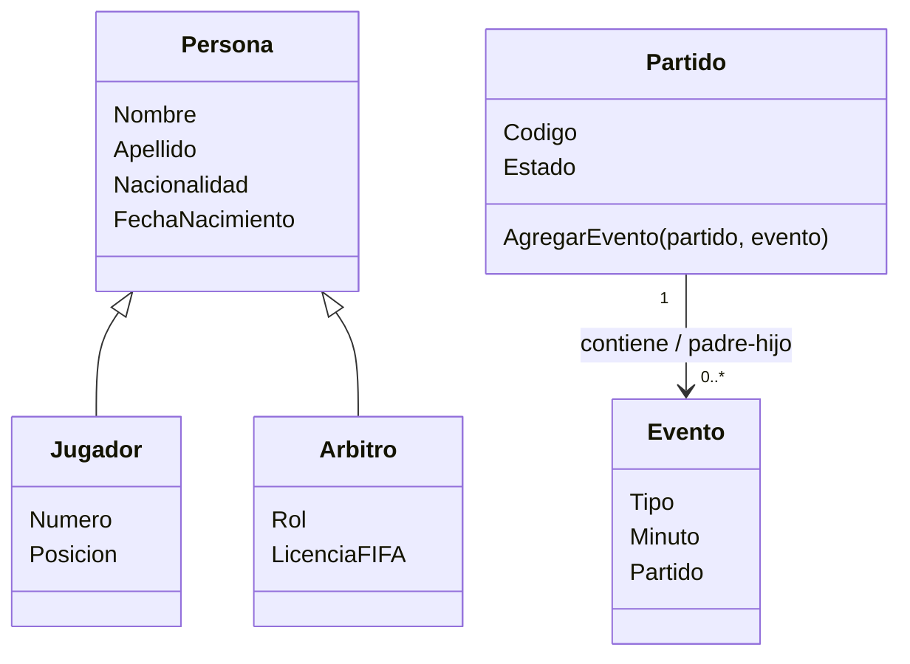

# Modelo de objetos — Hito 9 (IRIS)

## Alcance y propiedad de los datos

Este modelo satisface la práctica de persistencia orientada a objetos de Hito 9. No cambia la asignación de fuentes de verdad de Hitos 2 y 3: MongoDB conserva Jugadores y Neo4j conserva Partidos y Eventos. Las instancias de esas entidades creadas en IRIS son demostraciones aisladas del modelo y no una migración, una réplica sincronizada ni una nueva fuente autorizada. Árbitro se incluye por autorización explícita para cumplir RF4.

## Diagrama de clases

La clase base `Persona` reúne atributos comunes y es extendida por `Jugador` y `Arbitro`, dos tipos estables. Lesión, titularidad y suspensión son estados cambiantes y no se representan como subclases.

## Clases y campos

| Clase | Rol | Propiedad | Tipo ObjectScript | Obligatoria |
| --- | --- | --- | --- | --- |
| `Persona` | Clase persistente base | `Nombre` | `%String` | Sí |
| `Persona` | Clase persistente base | `Apellido` | `%String` | No |
| `Persona` | Clase persistente base | `Nacionalidad` | `%String` | No |
| `Persona` | Clase persistente base | `FechaNacimiento` | `%Date` | No |
| `Jugador` | Especialización de `Persona` | `Numero` | `%Integer` | Sí |
| `Jugador` | Especialización de `Persona` | `Posicion` | `%String` | Sí |
| `Arbitro` | Especialización de `Persona` | `Rol` | `%String` | Sí |
| `Arbitro` | Especialización de `Persona` | `LicenciaFIFA` | `%Boolean` | No |
| `Partido` | Padre de eventos | `Codigo` | `%String` | Sí |
| `Partido` | Padre de eventos | `Estado` | `%String` | Sí |
| `Partido` | Padre de eventos | `Eventos` | Relación `children` con `Evento` | — |
| `Evento` | Hijo subordinado | `Tipo` | `%String` | Sí |
| `Evento` | Hijo subordinado | `Minuto` | `%Integer` | Sí |
| `Evento` | Hijo subordinado | `Partido` | Relación `parent` con `Partido` | Sí por pertenencia |

Los tipos se limitan a los que ejemplifica Clase 10 (`%String`, `%Integer`, `%Date`, `%Boolean`) y las propiedades requeridas usan el modificador `[Required]` mostrado allí. La selección de requeridas fija el mínimo necesario para identificar y describir cada objeto del ejercicio; puede ajustarse si la compilación o la semántica del modelo muestran una incompatibilidad. La identidad persistente propia de IRIS no reemplaza los identificadores de negocio que ya usan MongoDB y Neo4j.

## Relación y reglas de integridad

`Partido.Eventos` es el extremo colección con cardinalidad `children`; `Evento.Partido` es el extremo hijo con cardinalidad `parent`, y ambos declaran la propiedad inversa. El índice explícito se define sobre `Evento.Partido`, que es el extremo muchos y el campo usado para localizar los eventos de un partido.

El ciclo de vida es de padre-hijo: un Evento no existe sin su Partido; si se elimina el Partido, sus Eventos subordinados se eliminan en cascada. La carga arma el padre y sus eventos y guarda solo el padre; la evidencia deberá mostrar el resultado del guardado y la navegación inversa.

La validación encapsulada rechazará agregar a un Partido `Finalizado` un Evento cuyo `Minuto` sea `0`, según el caso indicado por RF9. La operación de dominio verifica esta precondición antes de dejar persistir el cambio.

## Proyección SQL

`Fixture.Partido` se proyecta como tabla SQL. La demostración recupera `Codigo` y `Estado` de esa proyección para el partido recién creado. encontrado en documentación oficial: Clase 10 presenta `SELECT` sobre las clases persistentes, pero no el método para ejecutar SQL desde ObjectScript; se usa `$SYSTEM.SQL.Execute()` según [Using the SQL Shell Interface](https://docs.intersystems.com/irislatest/csp/docbook/DocBook.UI.Page.cls/documatic/changes/DocBook.UI.Page.cls?KEY=GSQL_shell), anotado también junto a la invocación en `Fixture.Demo.cls`.

## Identificadores y límites

- Para las instancias de demostración de Jugador, Partido y Evento se reutilizan, cuando correspondan, los identificadores de negocio ya presentes en los módulos MongoDB/Neo4j; no se inventa una nueva convención.
- Los objetos de ejemplo no se sincronizan con las fuentes autorizadas ni se ofrecen como datos operativos.
- No se agrega Equipo, Sede, Técnico ni otra entidad a este modelo. La relación Partido–Evento y la jerarquía Persona–Jugador/Árbitro cubren las necesidades estructurales de Hito 9.
